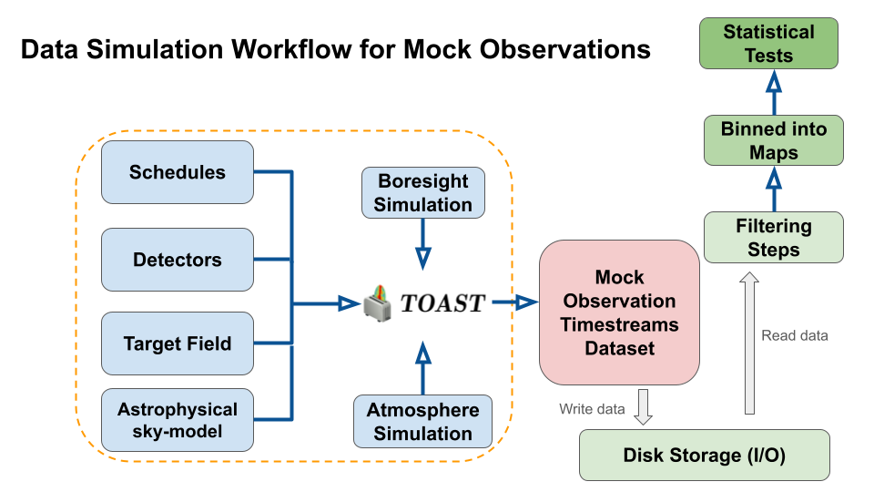
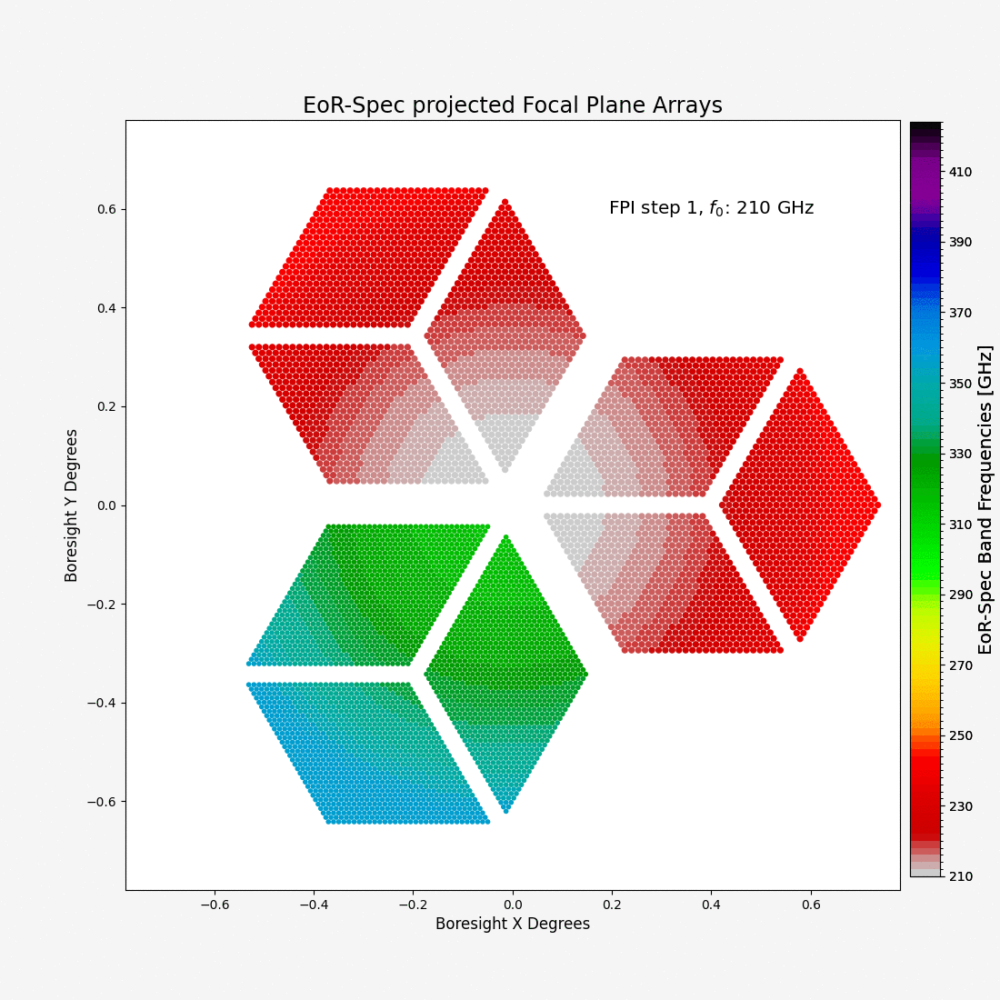
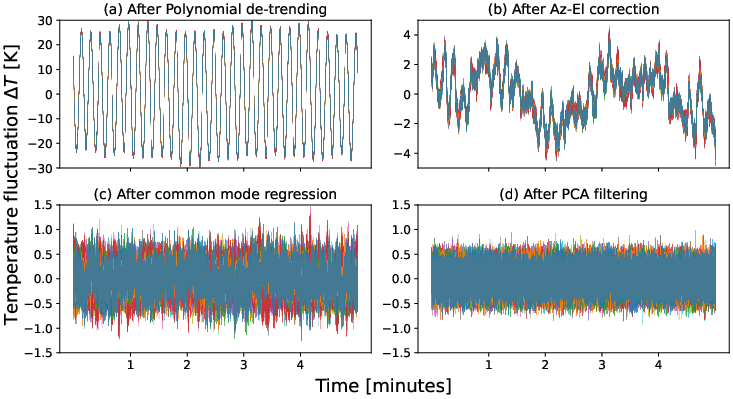
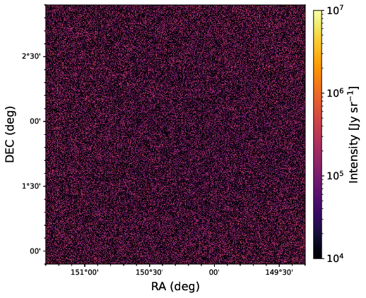

# eorspec_sims
This repository maintains the timestream simulations for the spectrometer instrument (called Epoch of Reionization Spectrometer, or EoR-Spec) on the 
[Prime-Cam](https://www.ccatobservatory.org/prime-cam/) instrument of the [Fred Young Submillimeter Telescope](https://www.ccatobservatory.org/) (FYST). 
A mock detector timestream dataset is generated, that is used to study correlated noise, systematics and map-making techniques for the spectrometer instrument.

If you intend to use these simulations, please get in touch with the corresponding author for further information or collaboration:
**Ankur Dev (adev@uni-bonn.de)**

---
Note: The simulation pipeline uses hybrid parallelism with OpenMP threading and MPI to run efficiently across multiple nodes. Large detector counts and intermediate buffers can require high memory per node, and full instrument runs may produce up to roughly 15 TB of output. Therefore, it is recommended to run these simulations on an High Performance Computing (HPC) cluster. This simulation was tested on the University of Bonn [Marvin Cluster](https://www.hpc.uni-bonn.de/en/systems/marvin).

---
The workflow uses the [Time Ordered Astrophysics Scalable Tools](https://github.com/hpc4cmb/toast/tree/toast3) (TOAST) framework and I defined a spectrometer focal-plane set-up for the EoR-Spec project to be compatible with this workflow. The focal-plane used in this project can be tracked at: [eorspec_focalplane](https://github.com/Ankurdev-astro/eorspec_focalplane).
A flowchart of the simulation workflow is shown below:

The input files are defined in `input_files`. Within that directory, the focalplanes for each FPI step is defined within `fp_files/fchl_h5`, the astrophysical CO and [CII] input map data is set in `input_maps` and the observing schedule is defined in `step_schedules`. The set-up is modular and new components can be introduced here in future work.
`aux` directory is used to generate the observation schedules and maintains other supporting files, while `scripts` is used for building the TOAST operators specific to this project and several other helper files.

The main timestream simulation including scanning, adding instrumental noise and atmospheric noise and writing mock detector data to disk is done with `sim_data_eorspec_mpi.py`, that utilises several core TOAST operators for including these noise components. The maps for each spectral bin are built using `write_toast_maps.py`, which uses custom built operators as well as TOAST native operators to load the simulated raw data, then filtering the correlated 1/f noise and writing binned maps to disk. These spectral maps can then be used to build the 3-D datacube for Line-Intensity Mapping science such as estimating the 3-D spherically averaged power spectrum. The spectral and detector count parameters used in the simulation are set in `params.csv`.

The `*.slurm` scripts are designed to run the above scripts on an HPC cluster and used to set [SLURM](https://slurm.schedmd.com/quickstart.html) parameters such as number of threads, number of MPI processes, number of nodes and memory per node needed for the HPC job. `slurm_job_launcher.sh` is used to assist with launching the SLURM jobs across multiple nodes for the different spectral bins.

---
EoR-Spec Focal-plane simulation for 15 different spectrometer steps (cavity gaps) is shown here:

An example of the filter-chain on a particular 5-minute observation dataset is shown below:

The cleaned timestream data is binned to spectral maps. An example result of the filter-and-bin map-making workflow is shown below. The map is mostly dominated by white-noise and most of the correlated noise was filtered out by the filter-chain.

